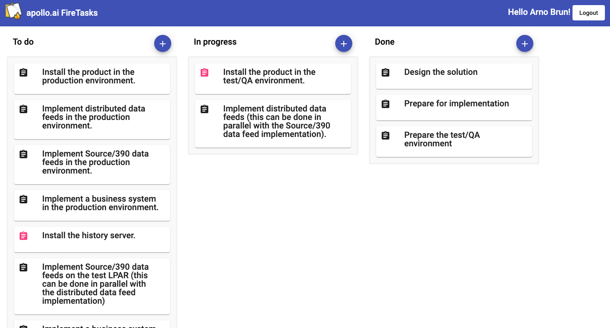

# 🔥 FireTasks 📋

This a small test project for job applicants of [apollo.ai](https://apollo.ai) to get a feel of the usual tasks we are facing in our daily dev process. It is a simple kanban-like task management SPA (think of trello simplified to its bare core) using Angular and powered by Firebase services. This is exactly the same technology stack as we use in our current real-life project.



## Current Features

- basic authentication (currently heavily simplified, see [Development](#development))
- lists of tasks grouped by their status (currently: `TODO`, `IN_PROGRESS`, `DONE`)
- ability for authenticated users to create new task and update or delete their own tasks, but not allowed to modify or delete tasks created/owned by other users.

Additionally the data model and test data also include a list of activities per task that can be flaged as completed but this data is currently not used.
And everyone can list all available users (which is currently only used for the mocked login ...but might come in handy😉)

## Technology Stack

- Angular 14.x
  - [Angular Material](https://material.angular.io/)
  - [Angular Fire](https://firebaseopensource.com/projects/angular/angularfire2/)
- Firebase services
  - Firebase Auth
  - Firestore
  - Firebase Emulator Suite (for local dev environment)

## Prerequisites

- Node v14.x (best use [nvm](https://github.com/nvm-sh/nvm))
- Firebase CLI (`npm i -g firebase-tools`)
- Java (for local firebase emulators)

## Local Dev Environment

For development of this project we use a local environment powered by the [firebase emulator suite](https://firebase.google.com/docs/emulator-suite). To get it up and running execute the following commands:

```bash 
# install frontend and backend (in functions folder) dependencies
yarn run install:all

# start firebase emulators for auth and firestore
yarn run start:emulators
```

As soon as the emulators have started and are running, you are left with an empty authentication db and firestore database. To insert initial test data into the emulators you need to run another command (in another terminal, do not close/shutdown the emulators): `yarn run apply:fixtures`. When this has completed successfully you should see a `tasks` and `users` collection when you go to your [local firestore UI](http://localhost:4100/firestore/) and you can continue and start the Angular development server.

## Angular Development server

Run `yarn start` for a dev server. Navigate to `http://localhost:4200/`. The app will automatically reload if you change any of the source files.

## Development

Since this is only a test show case project the login is simplified (and definitely not secure or how it should be done) BUT you can easily log into the various user accounts just with a click of a button on http://localhost:4200/login.
Every account is owner of at least one task and can only edit/delete the tasks he owns and/or create completely new ones. There is also a special handling implemented to allow any authenticated users to update the status of any task (this is the only task property non-task owners can modify).

To verify the data stored in firestore is properly secured against invalid or malicious access we implemented security rule tests that make use of the firestore emulator to verify the defined rules work as intended and the data access is secure.
If you have the emulators already running you can use `yarn --cwd functions test` to run these tests otherwise run `yarn --cwd functions test:ci` to automatically launch the emulator just for the test case and automatically shut it down right after completion.
You can find these tests in `functions/__tests__/securityrules` folder.

---
---

## Your Mission (should you choose to accept it 😉)

We want you to extend the current functionality so that users can easily drag&drop tasks from one status list into another.
Additionally we want to extend the currently quite empty task detail page to add a simple "ToDo list"-like checklist of activities that can be assigned to specific users and then checked as completed by the assigned user.

### Tasks

- drag & drop for tasks between status list on the task dashboard to update their status
  - all signed-in users should be allowed to change/move a task to another status list
  - the position within a list is irrelevant and does not need to be persisted
- add activities to task detail dialog (only owner should be able to create or delete activities)
  - simple CRUD functionality
  - activity title should be editable inline (only the task owner can update the title)
  - activity `isCompleted` flag should be toggle-able (everyone can toggle a task status)
  - ability to assign someone to an activity (everyone can assign an user to an activity, but there can only be 1 user a assigned to one activity at a time)
    - display avatar of assigned user next to the activity
- add count non-completed activities as badge to each task that has activities at the task dashboard

**BONUS:**
- create a new sub-site listing all activities assigned to the currently logged-in user

### Acceptance Criteria / Notes

- the position within a task list is irrelevant and does not need to be persisted.
- use the existing dependencies as best as you can and if you really need to add new ones please add a note explaining why you did so.
  - use [Angular Material](https://material.angular.io/) components to create the UI (this also includes the CDK - a set of behavior primitives for building UI components)
- all changes to the firestore security rules in `firestore.rules` need to be accompanied by a corresponding security rule test (like the ones in `functions/__tests__/securityrules/tasks.spec.ts` or `functions/__tests__/securityrules/users.spec.ts`).
- feel free to adapt the data models - some tasks might actually require it 😉

